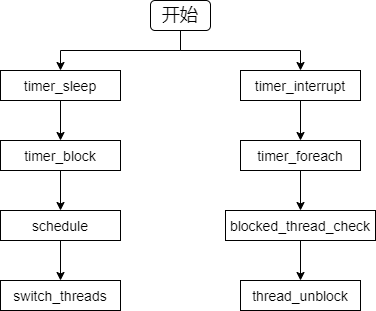
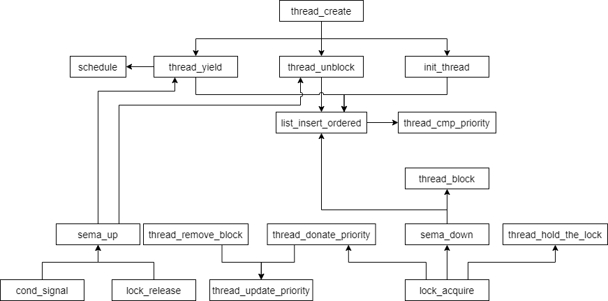
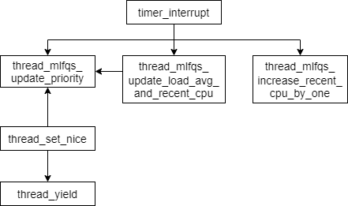

[TOC]

# Project1 threads

- 班级：网工1801
- 学号：201806021511
- 姓名：姜义杰

## Alarm Clock


### 数据结构  


#### struct threads

在thread结构体中添加一个sleep_ticks变量，用于记录这个线程sleep了多少时间。

声明为 `int64_t sleep_ticks;`

```c
struct thread
  {
    /* for prog 1 threads alarm clock */
    int64_t sleep_ticks;                /*记录这个线程被sleep了多少时间 */
    /* for prog 1 threads priority */
    int base_priority;                  /* Base priority. */
    struct list locks;                  /* Locks that the thread is holding. */
    struct lock* lock_waiting;          /* The lock that the thread is waiting for. */
     /* for prog 1 threads advanced */
    int nice;                           /* Niceness. */
    fixed_t recent_cpu;                 /* Recent CPU. */

    /* Owned by thread.c. */
    tid_t tid;                          /* Thread identifier. */
    enum thread_status status;          /* Thread state. */
    char name[16];                      /* Name (for debugging purposes). */
    uint8_t *stack;                     /* Saved stack pointer. */
    int priority;                       /* Priority. */
    struct list_elem allelem;           /* List element for all threads list. */

    /* Shared between thread.c and synch.c. */
    struct list_elem elem;              /* List element. */

#ifdef USERPROG
    /* Owned by userprog/process.c. */
    uint32_t *pagedir;                  /* Page directory. */
#endif

    /* Owned by thread.c. */
    unsigned magic;                     /* Detects stack overflow. */
  };
```


### 算法

#### 程序分析

- **问题分析** ：一开始的timer_sleep函数实现的是忙等“busy wait”，即线程依然不断在CPU就绪队列和running队列之间来回循环，检查当前时刻并调用thread_yield()函数，直到时间片耗尽。这种实现会占用大量CPU资源。重新实现的任务是避免“busy wait”，即繁忙等待现象的出现。

- **修改思路**：调用timer_sleep的时候直接阻塞线程，然后给线程结构体加一个成员sleep_ticks来记录这个线程被sleep了多少时间， 然后利用操作系统自身的时钟中断（每个tick会执行一次）加入对线程状态的检测， 每次检测将sleep_ticks减1, 遍历检查所有已有线程，当ticks_blocked == 0时，调用thread_unlock()函数唤醒这一进程。
- **ticks** 指的是pintos启动开始，系统执行时间的单位量
- 函数调用流程图如下所示




#### timer_sleep

```c
/* Sleeps for approximately TICKS timer ticks.  Interrupts must
   be turned on. */
void
timer_sleep (int64_t ticks) 
{
    if (ticks <= 0)
        return;

    ASSERT(intr_get_level() == INTR_ON);//当前中断状态为允许

    enum intr_level old_level = intr_disable();//禁止中断并返回之前的中断状态

    struct thread* current_thread = thread_current();//返回当前线程起始指针位置
    current_thread->sleep_ticks = ticks;//获取运行进程的sleep_ticks将其变为运行的tick值
    thread_block();//阻塞进程

    intr_set_level(old_level);
//timer_sleep就是在ticks时间内， 如果线程处于running状态就不断把他扔到就绪队列不让他执行。
//缺点： 线程依然不断在cpu就绪队列和running队列之间来回， 占用了cpu资源， 这并不是我们想要的， 我们希望用一种唤醒机制来实现这个函数。 
 /* int64_t start = timer_ticks ();//获取了起始时间

  ASSERT (intr_get_level () == INTR_ON);//断言 必须可以被中断  否则死循环  intr_get_level返回了intr_level的值
  while (timer_elapsed (start) < ticks) // 这个循环实质就是在ticks的时间内不断执行thread_yield()
    thread_yield ();*/
}
```


#### timer_interrupt

```c
/* Timer interrupt handler. */
static void
timer_interrupt (struct intr_frame *args UNUSED)
{
  ticks++;

  enum intr_level old_level = intr_disable();//保证原子性

  if (thread_mlfqs)
  {
      thread_mlfqs_increase_recent_cpu_by_one();
      if (ticks % TIMER_FREQ == 0)
          thread_mlfqs_update_load_avg_and_recent_cpu();
      else if (ticks % 4 == 0)
          thread_mlfqs_update_priority(thread_current());
  }
  thread_foreach(blocked_thread_check, NULL); //每个线程都执行blocked_thread_check这个函数
  
  intr_set_level(old_level);

  thread_tick ();
}
```


#### blocked_thread_check

```c
/* Check the blocked thread */
void
blocked_thread_check(struct thread* t, void* aux UNUSED)
{
    if (t->status == THREAD_BLOCKED && t->sleep_ticks > 0)
    {
        t->sleep_ticks--;
        if (t->sleep_ticks == 0)
        {
            thread_unblock(t);//把线程t丢到就绪队列里继续跑：
        }
    }
}
```

## Priority Scheduling

### 数据结构

#### struct threads

位于thread.h

添加如下声明：

```c
/* for prog 1 threads priority */	
	int base_priority;                  /* Base priority. */
    struct list locks;              /* Locks that the thread is holding. */
    struct lock* lock_waiting;      /* The lock that the thread is waiting for. */
    
```

#### struct lock

位于synch.h

添加如下声明

```c
/* for prog 1 threads priority */
    struct list_elem elem;      /* List element for priority donation. */
    int max_priority;           /* Max priority among the threads acquiring the lock. */
  
```


### 算法

#### 程序分析

函数调用流程图如下所示




1. 实现优先级调度的核心思想就是： 维持就绪队列为一个优先级队列。所以在插入线程到就绪队列的时候保证这个队列是一个优先级队列即可。观察threads.c后，发现如下三个函数中包含把一个线程丢到就绪队列中的操作

   - thread_unblock

   - init_thread

   - thread_yield

   **实现思路：**让这三个函数中的队列保持为优先级队列即可。

   需要修改的函数：thread_yield，thread_init，thread_cmp_priority。

   

2. 分析：thread1创建了一个PRI_DEFAULT+1优先级的内核线程thread2，然后由于thread2优先级高，

   所以线程执行直接切换到thread2， thread1阻塞， 然后thread2执行的时候调用的是changing_thread， 又把自身优先级调为PRI_DEFAULT-1,

   这个时候thread1的优先级就大于thread2了， 此时thread2阻塞于最后一个msg输出， 线程切换到thread1， 然后thread1又把自己优先级改成PRI_DEFAULT-2,

   这个时候thread2又高于thread1了， 所以执行thread2。

   **实现思路**: 在设置一个线程优先级要立即重新考虑所有线程执行顺序， 重新安排执行顺序。所以直接在线程设置优先级的时候调用thread_yield即可， 这样就把当前线程重新丢到就绪队列中继续执行， 保证了执行顺序。还有在创建线程的时候， 如果新创建的线程比主线程优先级高的话也要调用thread_yield。

   需要修改的函数：thread_set_priority，thread_create

3. 分析：首先当前线程（称为original_thread）是一个优先级为PRI_DEFAULT的线程， 然后第4行创建了一个锁， 接着创建一个线程acquire1，优先级为PRI_DEFAULT+1, 传了一个参数为这个锁的函数过去（线程acquire1执行的时候会调用）。

   original_thread拥有的锁被acquire1获取之后， 因为acquire1线程被阻塞于这个锁， 那么acquire1的执行必须要original_thread继续执行释放这个锁， 从优先级的角度来说， original_thread的优先级应该提升到acquire1的优先级，

   因为original_thread本身的执行包含了acquire1执行的阻塞， 所以此时acquire1对original_thread做了捐赠， 优先级提到PRI_DEFAULT+1， acquire2行为类似。

   **实现思路**:  

   - 在一个线程获取一个锁的时候， 如果拥有这个锁的线程优先级比自己低就提高它的优先级，并且如果这个锁还被别的锁锁着， 将会递归地捐赠优先级， 然后在这个线程释放掉这个锁之后恢复未捐赠逻辑下的优先级。

   - 如果一个线程被多个线程捐赠， 维持当前优先级为捐赠优先级中的最大值（acquire和release之时）。

   - 在对一个线程进行优先级设置的时候， 如果这个线程处于被捐赠状态， 则对original_priority进行设置， 然后如果设置的优先级大于当前优先级， 则改变当前优先级， 否则在捐赠状态取消的时候恢复original_priority。

   - 在释放锁对一个锁优先级有改变的时候应考虑其余被捐赠优先级和当前优先级。

   - 将信号量的等待队列实现为优先级队列。

   - 将condition的waiters队列实现为优先级队列。

   - 释放锁的时候若优先级改变则可以发生抢占。

   需要修改的函数：thread_set_priority，thread_create

下面的每个函数的详细修改

#### thread_yield

把该函数里的list_push_back 替换为list_insert_ordered

```c
bool 
thread_cmp_priority(const struct list_elem* a, const struct list_elem* b, void* aux UNUSED)
{
    return list_entry(a, struct thread, elem)->priority > list_entry(b, struct thread, elem)->priority;
}
```


#### thread_init

把该函数里的list_push_back 替换为list_insert_ordered

```c
static void
init_thread (struct thread *t, const char *name, int priority)
{
  enum intr_level old_level;

  ASSERT (t != NULL);
  ASSERT (PRI_MIN <= priority && priority <= PRI_MAX);
  ASSERT (name != NULL);

  memset (t, 0, sizeof *t);
  t->status = THREAD_BLOCKED;
  strlcpy (t->name, name, sizeof t->name);
  t->stack = (uint8_t *) t + PGSIZE;
  t->priority = priority;
  t->magic = THREAD_MAGIC;

  t->nice = 0;
  t->recent_cpu = FP_CONST(0);

  /*for prog 1 threads priority*/
  t->base_priority = priority;
  list_init(&t->locks);
  t->lock_waiting = NULL;
    
  //old_level = intr_disable ();
  //list_push_back (&all_list, &t->allelem);
  list_insert_ordered(&all_list, &t->allelem, (list_less_func*)&thread_cmp_priority, NULL);
  //intr_set_level (old_level);
}
```

#### thread_cmp_priority


```c
bool 
thread_cmp_priority(const struct list_elem* a, const struct list_elem* b, void* aux UNUSED)
{
    return list_entry(a, struct thread, elem)->priority > list_entry(b, struct thread, elem)->priority;
}
```


#### thread_unblock

把该函数里的list_push_back 替换为list_insert_ordered

```c
void
thread_unblock (struct thread *t) 
{
  enum intr_level old_level;

  ASSERT (is_thread (t));

  old_level = intr_disable ();
  ASSERT (t->status == THREAD_BLOCKED);
  //list_push_back (&ready_list, &t->elem);
  list_insert_ordered(&ready_list, &t->elem, (list_less_func*)&thread_cmp_priority, NULL);
  t->status = THREAD_READY;
  intr_set_level (old_level);
}
```


#### thread_set_priority

设置线程优先级时，也要及时维护就绪队列的优先级顺序。当设置完线程优先级后，调用`thread_yield`函数将改变了优先级（新设置了优先级）的线程有序地加入就绪队列。

只有当当前线程仍有等待获取的锁或当前线程优先级被捐赠（即`new_priority` > `old_priority`）时，才设置当前线程优先级为新的指定优先级`new_priority`。

```c
void
thread_set_priority (int new_priority) 
{
    if (thread_mlfqs)
        return;
    enum intr_level old_level = intr_disable();

    struct thread* current_thread = thread_current();
    int old_priority = current_thread->priority;
    current_thread->base_priority = new_priority;

    if (list_empty(&current_thread->locks) || new_priority > old_priority)
    {
        current_thread->priority = new_priority;
        thread_yield();
    }

    intr_set_level(old_level);

  /*thread_current ()->priority = new_priority;
  thread_yield();//把当前线程重新丢到就绪队列中继续执行， 保证了执行顺序*
  */
}
```

#### thread_create

创建线程时也会涉及到维护优先级队列问题。如果当前线程的优先级小于新创建线程优先级，那么将当前线程挂起加入就绪队列。

在把创建的线程unblock了之后添加

```c
tid_t
thread_create (const char *name, int priority,
               thread_func *function, void *aux) 
{
    ......
     /* 根据新线程的优先级判断是否要将当前线程插入ready list就绪队列 */
  if (thread_current()->priority < priority)
      thread_yield();
}
```


#### lock_acquire

在P操作之前递归地实现优先级捐赠， 然后在被唤醒之后（此时这个线程已经拥有了这个锁），成为这个锁的拥有者。

```c
void
lock_acquire (struct lock *lock)
{
  struct thread* current_thread = thread_current();
  struct lock* l;
  enum intr_level old_level;
  
  ASSERT(lock != NULL);
  ASSERT(!intr_context());
  ASSERT(!lock_held_by_current_thread(lock));
  
  if (lock->holder != NULL && !thread_mlfqs)
   {
     current_thread->lock_waiting = lock;
     l = lock;
     while (l && current_thread->priority > l->max_priority)
     {
        l->max_priority = current_thread->priority;
        thread_donate_priority(l->holder);
        l = l->holder->lock_waiting;
     }
   }

   sema_down(&lock->semaphore);
   
   old_level = intr_disable();//保证原子操作
 
   current_thread = thread_current();
   if (!thread_mlfqs)
   {
       current_thread->lock_waiting = NULL;
       lock->max_priority = current_thread->priority;
       thread_hold_the_lock(lock);
   }
   lock->holder = current_thread;
    
   intr_set_level(old_level);

}
```

#### thread_hold_the_lock

让线程拥有锁lock

一个线程获得锁后，重新对等待它的所有线程优先级排列，并根据其中的最大优先级实现捐赠。

```c
void
thread_hold_the_lock(struct lock* lock)
{
    enum intr_level old_level = intr_disable();
    list_insert_ordered(&thread_current()->locks, &lock->elem, lock_cmp_priority, NULL);//将获取该锁线程的优先级有序地插入到线程所持有的锁队列中

    if (lock->max_priority > thread_current()->priority)
    {
        thread_current()->priority = lock->max_priority;
        thread_yield();
    }//如果当前线程优先级小于等待获得锁的线程里的最大优先级，则提升当前线程优先级到那个最大的优先级，然后yield挂起放入就绪队列中参与竞争

    intr_set_level(old_level);
}
```

#### thread_donate_priority

将当前线程的优先级捐赠给线程t

通过调用`thread_update_priority`更新持有锁线程的优先级。然后在就绪队列中重新安排线程的先后顺序（按照新的优先级顺序），实现方法为将修改过的线程优先级先删除再有序地插入。

```c
void
thread_donate_priority(struct thread* t)
{
    enum intr_level old_level = intr_disable();
    thread_update_priority(t);

    /* Remove the old t and insert the new one in order */
    if (t->status == THREAD_READY)
    {
        list_remove(&t->elem);
        list_insert_ordered(&ready_list, &t->elem, thread_cmp_priority, NULL);//按优先级插入队列
    }
    intr_set_level(old_level);
}
```

#### lock_cmp_priority

用于锁队列排序

队列（等待获取该锁的线程队列）优先级比较函数，类似于前面的`thread_cmp_priority`函数。

```c
bool
lock_cmp_priority(const struct list_elem* a, const struct list_elem* b, void* aux UNUSED)
{
    return list_entry(a, struct lock, elem)->max_priority > list_entry(b, struct lock, elem)->max_priority;
}
```

#### lock_release

当前线程调用`thread_remove_lock`释放锁。并更新锁的拥有者为空，信号量+1，表示锁已经释放。

```c
void
lock_release (struct lock *lock) 
{
  ASSERT (lock != NULL);
  ASSERT (lock_held_by_current_thread (lock));

  /*for prog 1 threads priority*/
  if (!thread_mlfqs)
      thread_remove_lock(lock);

  lock->holder = NULL;
  sema_up (&lock->semaphore);
}
```

#### thread_remove_lock

从锁队列里移除当前的优先级，从而释放一个锁。释放锁后，调用`thread_update_priority`更新当前线程的优先级。

```c
void
thread_remove_lock(struct lock* lock)
{
    enum intr_level old_level = intr_disable();
    list_remove(&lock->elem);
    thread_update_priority(thread_current());
    intr_set_level(old_level);
}
```

#### thread_update_priority

当释放掉一个锁的时候， 当前线程的优先级可能发生变化，所以使用该函数来处理这种情况。

如果这个线程还有锁， 就先获取这个线程拥有锁的最大优先级（可能被更高级线程捐赠）， 然后如果这个优先级比base_priority大的话更新的应该是被捐赠的优先级。

进行优先级捐献或是释放锁时，我们需要更新持有锁线程的优先级。并且当这个线程还有持有其它锁时，要判断其它锁的最大优先级（也会被捐赠给这个线程）和这个线程的`base_priority`，如果其它锁的最大优先级大于`base_priority`，那么被捐赠的优先级`lock_priority`要更新成为那个最大优先级，而不是更新`base_priority`；反之，直接恢复`base_priority`。以此解决一个线程持有好几个锁的情况。

```c
void
thread_update_priority(struct thread* t)
{
    enum intr_level old_level = intr_disable();
    int max_priority = t->base_priority;//锁的最大优先级属性初始化为原来持有该锁的线程的原始优先级
    int lock_priority;

    if (!list_empty(&t->locks))
    {
        list_sort(&t->locks, lock_cmp_priority, NULL);
        lock_priority = list_entry(list_front(&t->locks), struct lock, elem)->max_priority;
        if (lock_priority > max_priority)
            max_priority = lock_priority;
    }

    t->priority = max_priority;
    intr_set_level(old_level);
}
```

#### init_thread

添加如下片段：

```c
 /*for prog 1 threads priority*/ 
  t->base_priority = priority;
  list_init(&t->locks);
  t->lock_waiting = NULL;
```

#### thread_set_priority

见上面的描述

#### cond_signal

根据等待cond的线程的优先级大小修改cond队列顺序（`list_sort`），然后调用`sema_up`唤醒优先级最高的线程。

```c
void
cond_signal(struct condition* cond, struct lock* lock UNUSED)
{
    ASSERT(cond != NULL);
    ASSERT(lock != NULL);
    ASSERT(!intr_context());
    ASSERT(lock_held_by_current_thread(lock));

    if (!list_empty(&cond->waiters))
    { 
        list_sort(&cond->waiters, cond_sema_cmp_priority, NULL);
        sema_up(&list_entry(list_pop_front(&cond->waiters),
            struct semaphore_elem, elem)->semaphore);
    }
}
```

#### cond_sema_cmp_priority

比较等待条件变量的信号量大小的函数，类似于前面的`thread_cmp_priority`函数。

```c
bool
cond_sema_cmp_priority(const struct list_elem* a, const struct list_elem* b, void* aux UNUSED)
{
    struct semaphore_elem* sa = list_entry(a, struct semaphore_elem, elem);
    struct semaphore_elem* sb = list_entry(b, struct semaphore_elem, elem);
    return list_entry(list_front(&sa->semaphore.waiters), struct thread, elem)->priority > list_entry(list_front(&sb->semaphore.waiters), struct thread, elem)->priority;
}

```

#### sema_up

V操作

当信号量等待队列不为空时，根据信号量队列中线程的优先级大小修改sema队列顺序（`list_sort`），然后将优先级最高的线程解除阻塞状态。然后信号量+1，将当前线程加入就绪队列竞争。

```c
void
sema_up (struct semaphore *sema) 
{
  enum intr_level old_level;

  ASSERT (sema != NULL);

  old_level = intr_disable ();
  if (!list_empty(&sema->waiters))
  {
      list_sort(&sema->waiters, thread_cmp_priority, NULL);//new
      thread_unblock(list_entry(list_pop_front(&sema->waiters),
          struct thread, elem));
  }
    
  sema->value++;
  thread_yield();//new
  intr_set_level (old_level);
}
```

#### sema_down

P操作

若信号量为0，表示不可继续获得锁。则把当前线程有序地插入到信号量等待线程队列当中去，然后阻塞该线程，信号量-1

```c
void
sema_down (struct semaphore *sema) 
{
  enum intr_level old_level;

  ASSERT (sema != NULL);
  ASSERT (!intr_context ());

  old_level = intr_disable ();
  while (sema->value == 0) 
    {
      //new
      list_insert_ordered(&sema->waiters, &thread_current()->elem, thread_cmp_priority, NULL);
      //list_push_back (&sema->waiters, &thread_current ()->elem);
      thread_block ();
    }
  sema->value--;
  intr_set_level (old_level);
}
```


## Advanced Scheduler

### 数据结构

#### struct threads

添加了如下声明

```c
     /* for prog 1 threads advanced */
    int nice;                           /* Niceness. */
    fixed_t recent_cpu;                 /* Recent CPU. */
```

#### load_avg

在thread.c中添加全局变量

```c
fixed_t load_avg;
```


### 算法

#### 程序分析

- 函数调用流程图如下所示



- 本模块的任务是实现多级反馈调度，并实现减少系统平均响应时间的功能。

- 这里是维持了64个队列， 每个队列对应一个优先级， 从PRI_MIN到PRI_MAX。然后通过一些公式计算来计算出线程当前的优先级， 系统调度的时候会从高优先级队列开始选择线程执行， 这里线程的优先级随着操作系统的运转数据而动态改变。
- 由于涉及到浮点数运算，所以将这类运算定义在一个.h文件中，使用时用头文件包含即可。

- **实现思路：** 在timer_interrupt中固定一段时间计算更新线程的优先级，这里是每TIMER_FREQ时间更新一次系统load_avg和所有线程的recent_cpu， 每4个timer_ticks更新一次线程优先级， 每个timer_tick running线程的recent_cpu加一， 虽然这里说的是维持64个优先级队列调度， 其本质还是优先级调度， 我们保留之前写的优先级调度代码即可， 去掉优先级捐赠（之前donate相关代码已经对需要的地方加了thread_mlfqs的判断了）。


#### fixed_point.h

用于实现浮点数运算。这里用了16位数表示小数部分，因此对整数的运算从第17位开始。

| Convert `n` to fixed point:                    | `n * f`                                                      |
| ---------------------------------------------- | ------------------------------------------------------------ |
| Convert `x` to integer (rounding toward zero): | `x / f`                                                      |
| Convert `x` to integer (rounding to nearest):  | `(x + f / 2) / f` if `x >= 0`,  `(x - f / 2) / f` if `x <= 0`. |
| Add `x` and `y`:                               | `x + y`                                                      |
| Subtract `y` from `x`:                         | `x - y`                                                      |
| Add `x` and `n`:                               | `x + n * f`                                                  |
| Subtract `n` from `x`:                         | `x - n * f`                                                  |
| Multiply `x` by `y`:                           | `((int64_t) x) * y / f`                                      |
| Multiply `x` by `n`:                           | `x * n`                                                      |
| Divide `x` by `y`:                             | `((int64_t) x) * f / y`                                      |
| Divide `x` by `n`:                             | `x / n`                                                      |

```c
#ifndef __THREAD_FIXED_POINT_H
#define __THREAD_FIXED_POINT_H

/* Basic definitions of fixed point. */
typedef int fixed_t;
/* 16 LSB used for fractional part. */
#define FP_SHIFT_AMOUNT 16
/* Convert a value to fixed-point value. */
#define FP_CONST(A) ((fixed_t)(A << FP_SHIFT_AMOUNT))
/* Add two fixed-point value. */
#define FP_ADD(A,B) (A + B)
/* Add a fixed-point value A and an int value B. */
#define FP_ADD_MIX(A,B) (A + (B << FP_SHIFT_AMOUNT))
/* Substract two fixed-point value. */
#define FP_SUB(A,B) (A - B)
/* Substract an int value B from a fixed-point value A */
#define FP_SUB_MIX(A,B) (A - (B << FP_SHIFT_AMOUNT))
/* Multiply a fixed-point value A by an int value B. */
#define FP_MULT_MIX(A,B) (A * B)
/* Divide a fixed-point value A by an int value B. */
#define FP_DIV_MIX(A,B) (A / B)
/* Multiply two fixed-point value. */
#define FP_MULT(A,B) ((fixed_t)(((int64_t) A) * B >> FP_SHIFT_AMOUNT))
/* Divide two fixed-point value. */
#define FP_DIV(A,B) ((fixed_t)((((int64_t) A) << FP_SHIFT_AMOUNT) / B))
/* Get integer part of a fixed-point value. */
#define FP_INT_PART(A) (A >> FP_SHIFT_AMOUNT)
/* Get rounded integer of a fixed-point value. */
#define FP_ROUND(A) (A >= 0 ? ((A + (1 << (FP_SHIFT_AMOUNT - 1))) >> FP_SHIFT_AMOUNT) \
        : ((A - (1 << (FP_SHIFT_AMOUNT - 1))) >> FP_SHIFT_AMOUNT))

#endif /* thread/fixed_point.h */
```

#### timer_interrupt

每个`timer_tick` 正在运行的线程的recent_cpu加一，每`TIMER_FREQ`时间计算一次`load_avg`和`recent_cpu`，然后每4次`timer_ticks`计算更新一次线程的优先级。

```c
static void
timer_interrupt (struct intr_frame *args UNUSED)
{
  ticks++;

  enum intr_level old_level = intr_disable();//保证原子性

  if (thread_mlfqs)
  {
      thread_mlfqs_increase_recent_cpu_by_one();
      if (ticks % TIMER_FREQ == 0)
          thread_mlfqs_update_load_avg_and_recent_cpu();
      else if (ticks % 4 == 0)
          thread_mlfqs_update_priority(thread_current());
  }
  thread_foreach(blocked_thread_check, NULL); //每个线程都执行blocked_thread_check这个函数
  
  intr_set_level(old_level);

  thread_tick ();
}
```

#### thread_mlfqs_increase_recent_cpu_by_one

如果当前线程不是空闲的，那么就调用`FP_ADD_MIX`使得线程的`recent_cpu`+1（即`timer_ticks`中断次数+1次）

```c
void
thread_mlfqs_increase_recent_cpu_by_one(void)
{
    ASSERT(thread_mlfqs);
    ASSERT(intr_context());

    struct thread* current_thread = thread_current();
    if (current_thread == idle_thread)
        return;
    current_thread->recent_cpu = FP_ADD_MIX(current_thread->recent_cpu, 1);
}
```

#### thread_mlfqs_update_load_avg_and_recent_cpu

为所有线程更新`load_avg`和`recent_cpu`

```c
void
thread_mlfqs_update_load_avg_and_recent_cpu (void)
{
  ASSERT (thread_mlfqs);
  ASSERT (intr_context ());

  size_t ready_threads = list_size (&ready_list);
  if (thread_current () != idle_thread)
    ready_threads++;//处于就绪状态的线程数+1
  load_avg = FP_ADD (FP_DIV_MIX (FP_MULT_MIX (load_avg, 59), 60), FP_DIV_MIX (FP_CONST (ready_threads), 60));//计算load_avg（过去一分钟处于就绪状态的线程数）

  struct thread *t;
  struct list_elem *e = list_begin (&all_list);
  for (; e != list_end (&all_list); e = list_next (e))
  {
    t = list_entry(e, struct thread, allelem);
    if (t != idle_thread)
    {
      t->recent_cpu = FP_ADD_MIX (FP_MULT (FP_DIV (FP_MULT_MIX (load_avg, 2), FP_ADD_MIX (FP_MULT_MIX (load_avg, 2), 1)), t->recent_cpu), t->nice);//计算recent_cpu
      thread_mlfqs_update_priority (t);
    }
  }
}

```

#### thread_mlfqs_update_priority

更新线程t的优先级，先根据公式计算`t->priority`，然后再修改它：`t->priority`先取它本身和`PRI_MIN`的最大值，再取它本身和`PRI_MAX`的最小值。

```c
void
thread_mlfqs_update_priority(struct thread* t)
{
    if (t == idle_thread)
        return;

    ASSERT(thread_mlfqs);
    ASSERT(t != idle_thread);

    t->priority = FP_INT_PART(FP_SUB_MIX(FP_SUB(FP_CONST(PRI_MAX), FP_DIV_MIX(t->recent_cpu, 4)), 2 * t->nice));
    t->priority = t->priority < PRI_MIN ? PRI_MIN : t->priority;
    t->priority = t->priority > PRI_MAX ? PRI_MAX : t->priority;
}
```

#### init_thread

线程初始化的时候初始化这两个新的成员

```c
  t->nice = 0;
  t->recent_cpu = FP_CONST(0);
```

#### thread_start

添加对load_avg的初始化

```c
void
thread_start (void) 
{
  /* Create the idle thread. */
  struct semaphore idle_started;
  sema_init (&idle_started, 0);
  thread_create ("idle", PRI_MIN, idle, &idle_started);

  load_avg = FP_CONST(0);

  /* Start preemptive thread scheduling. */
  intr_enable ();

  /* Wait for the idle thread to initialize idle_thread. */
  sema_down (&idle_started);
}
```

#### thread_set_nice

设置当前线程的nice值。

其中`nice`为线程属性，取值区间为[-20,+20]，数值越大表示该线程出让更多的CPU时间。`set_nice`函数为线程设置`nice`的值。

```c
void
thread_set_nice (int nice) 
{
    thread_current()->nice = nice;
    thread_mlfqs_update_priority(thread_current());
    thread_yield();
}
```

#### thread_get_nice

获取当前线程的nice值

```c
int
thread_get_nice (void) 
{
  return thread_current()->nice;
}
```

#### thread_get_load_avg

获取`load_avg`乘以100的值。

```c
/* Returns 100 times the system load average */
int
thread_get_load_avg (void) 
{
    return FP_ROUND(FP_MULT_MIX(load_avg, 100));
}
```

#### thread_get_recent_cpu

获取`recent_cpu`乘以100的值

```c
/* Returns 100 times the current thread's recent_cpu value. */
int
thread_get_recent_cpu (void) 
{
    return FP_ROUND(FP_MULT_MIX(thread_current()->recent_cpu, 100));
}
```

