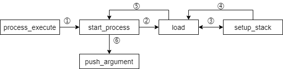

[TOC]

# Project2 userprog

- 班级：网工1801
- 学号：201806021511
- 姓名：姜义杰

## Process Termination Messages


### 数据结构  

#### struct thread

添加如下声明

```c
#ifdef USERPROG
    /* Owned by userprog/process.c. */
    uint32_t *pagedir;                  /* Page directory. */
#endif
```

### 算法

- **实现分析：**在进程结束时输出退出代码(即main函数的返回值，或者异常退出代码。

#### process_exit

每当一个用户进程因为该进程调用`exit`或其它原因而结束时，需要打印该进程的进程名和退出码（`exit code`）。

同时，在结束一个进程时，我们要释放该进程占用的所有资源。

```c
void
process_exit (void)
{
  struct thread *cur = thread_current ();
  uint32_t *pd;
  int exit_status = current_thread->exit_status;//exit_status变量为退出状态
  if (exit_status == INIT_EXIT_STAT)
    exit_process(-1);

  printf("%s: exit(%d)\n",current_thread->name,exit_status);//打印当前线程名和退出状态

  /* 销毁当前线程的页目录，切换回内核目录 */
  pd = cur->pagedir;
  if (pd != NULL)
  {
    cur->pagedir = NULL;//当前线程页面设置为空，保证timer的中断就不会切换回进程页面目录
    pagedir_activate (NULL);//激活线程页表
    pagedir_destroy (pd);//销毁线程页面之前的目录
  }
}

```


## Argument Passing

### 数据结构

#### struct threads

添加如下声明

```c
    struct list childs;                 /* The list of childs */
    struct child * thread_child;        /* Store the child of this thread */
    int st_exit;                        /* Exit status */
    struct semaphore sema;              /* Control the child process's logic, finish parent waiting for child */
    bool success;                       /* Judge whehter the child's thread execute successfully */
    struct thread* parent;              /* Parent thread of the thread */
```


### 算法

#### 程序分析

- 函数调用流程图如下所示



- 本模块的任务是实现参数传递给新进程，通过扩展`process_execute（）`来实现此功能。使它不仅将程序文
  件名作为参数，而且还将其分成空格。第一个单词是程序名称，第二个单词是第一个参数，依此类推。

- **实现思路：** `process_execute`创建线程，并分离参数，并把参数（含文件名）传递给`start_process`函数，让新线程执行`start_process`函数。`start_process`将参数继续传递给`load`函数，`load`函数为用户程序分配了地址空间，并继续将参数传递给`setup_stack`函数，`setup_stack`创建了用户栈并返回到`load`，`load`返回到`start_process`。接下来，在`start_process`中调用`push_argument`将用户程序所需的参数argc,argv及他们的地址入栈。这样就利用参数传递，完成了用户程序执行的准备过程。

下面是每个函数的详细修改

#### process_execute

把传入的参数*file_name*用`strtok_r`函数分隔开，获得线程名，为接下来的参数传递（之后会传递给`start_process`,`load` , `setup_stack`）做准备。并以此为线程名创建一个新线程，然后新线程转去执行`start_process`函数。若子进程加载可执行文件的过程没有问题，则返回新建线程的tid.在这之前，父进程无法返回。这样的同步操作是依靠struct thread里的success变量以及信号量的增减实现的。success记录了线程是否成功执行，而通过创建子进程时父进程信号量减少、子进程结束时父进程信号量增加来实现父进程等待子进程的效果，并保证子进程结束唤醒父进程。

```c
tid_t
process_execute (const char *file_name)
{
  tid_t tid;
  char *fn_copy = malloc(strlen(file_name)+1);
  char *fn_copy2 = malloc(strlen(file_name)+1);
  strlcpy (fn_copy, file_name, strlen(file_name)+1);
  strlcpy (fn_copy2, file_name, strlen(file_name)+1);//file_name的两份拷贝，避免caller和load的冲突
  
  char *save_ptr;
  fn_copy2 = strtok_r (fn_copy2, " ", &save_ptr);//用strtok_r函数分离字符串，获得thread_name（存放在fn_copy2），为实现参数传递做准备
    
  /* 创建以file_name为名字的新线程，新的子进程执行start_process函数. */
  tid = thread_create (fn_copy2, PRI_DEFAULT, start_process, fn_copy);
  free(fn_copy2);   //手动释放fn_copy2
    
  if (tid == TID_ERROR){
    free (fn_copy);
    return tid;
  }
  sema_down(&thread_current()->sema);//降低父进程的信号量，等待子进程结束
  if (!thread_current()->success) return TID_ERROR;//子进程加载可执行文件失败报错  
  return tid;
}
```


#### push_argument

根据argc的大小将argv数组压入栈。在前面`start_process`函数中被调用。压入栈顶的过程中，依次存放入参数argv数组（靠参数分离得到）、argv的地址和argc的地址。

```c
void
push_argument (void **esp, int argc, int argv[]){
  *esp = (int)*esp & 0xfffffffc;
  *esp -= 4;
  *(int *) *esp = 0;
  /*下面这个for循环的意义是：按照argc的大小，循环压入argv数组，这也符合argc和argv之间的关系*/
  for (int i = argc - 1; i >= 0; i--)
  {
    *esp -= 4;//每次入栈后栈指针减4
    *(int *) *esp = argv[i];
  }
  *esp -= 4;
  *(int *) *esp = (int) *esp + 4;
  *esp -= 4;
  *(int *) *esp = argc;
  *esp -= 4;
  *(int *) *esp = 0;
}
```

#### start_process

对于刚刚新创建的线程，先初始化中断帧，再调用`load`函数（`load`还会调用`setup_stack`，为程序分配内存并创建用户栈）。如果调用成功，分配好了地址空间并创建完成用户栈，则调用`push_argument`把argv数组压入栈顶，否则就退出当前的线程。

```c
static void
start_process (void *file_name_)
{
  char *file_name = file_name_;
  struct intr_frame if_;
  bool success;
    
  char *fn_copy=malloc(strlen(file_name)+1);
  strlcpy(fn_copy,file_name,strlen(file_name)+1);//file_name的一份拷贝

  
  memset (&if_, 0, sizeof if_);
  if_.gs = if_.fs = if_.es = if_.ds = if_.ss = SEL_UDSEG;
  if_.cs = SEL_UCSEG;
  if_.eflags = FLAG_IF | FLAG_MBS;
  
  char *token, *save_ptr;
  file_name = strtok_r (file_name, " ", &save_ptr);//字符串分离，得到线程名，为了传入接下来load函数的参数
  success = load (file_name, &if_.eip, &if_.esp);
    //调用load函数，判断其是否成功load

  if (success){
    int argc = 0;
    //限制命令行长度不得超过50
    int argv[50];
    
    //token也就是命令行输入的参数分离后得到的数组，包含了argv
    for (token = strtok_r (fn_copy, " ", &save_ptr); token != NULL; token = strtok_r (NULL, " ", &save_ptr)){
      if_.esp -= (strlen(token)+1);
      memcpy (if_.esp, token, strlen(token)+1);//栈指针退后token的长度，空出token长度的空间用来存放token
      argv[argc++] = (int) if_.esp;//argv数组的末尾存放栈顶地址，也就是argv的地址
    }
    push_argument (&if_.esp, argc, argv);//将argv参数数组按argc的大小推入栈

    thread_current ()->parent->success = true;//保存父进程的执行状态为成功执行
    sema_up (&thread_current ()->parent->sema);//提升父进程的信号量
  }

  //如果调用load失败，则：
  else{
    thread_current ()->parent->success = false;//保存父进程的执行状态为执行失败
    sema_up (&thread_current ()->parent->sema);//提升父进程的信号量
    thread_exit ();//退出
  }
  
  asm volatile ("movl %0, %%esp; jmp intr_exit" : : "g" (&if_) : "memory");
  NOT_REACHED ();
}
```


#### file_deny_write

将文件设置为拒绝写入的状态，目的是为了防止对一个文件进行写入操作，直到`file_allow_write`被调用或该文件被关闭。在`load`函数中被调用。

```c
void
file_deny_write (struct file *file) 
{
  ASSERT (file != NULL);
  if (!file->deny_write) 
    {
      file->deny_write = true;
      inode_deny_write (file->inode);
    }//如果file的deny_write属性为false，则置为true
}
```


#### load

为当前用户程序分配内存，初始化页目录。之后调用`setup_stack`创建用户栈，并把参数传入`setup_stack`.

```c
bool
load (const char *file_name, void (**eip) (void), void **esp)
{
  struct thread *t = thread_current();
  struct Elf32_Ehdr ehdr;
  struct file *file = NULL;
  off_t file_ofs;
  bool success = false;
  int i;
  
  /*分配页目录 */
  t->pagedir = pagedir_create();
  if (t->pagedir == NULL)
    goto done;
  process_activate();
    
  acquire_lock_f ();
  file = filesys_open (file_name);//根据传入load函数的参数file_name打开指定文件
  if (file == NULL)
  {
    printf ("load: %s: open failed\n", file_name);
    goto done;
  }//打开失败
  
  /* 通过调用file_deny_write函数，拒绝写入文件 */
  file_deny_write(file);
  t->file_owned = file;

  
  if (file_read(file, &ehdr, sizeof ehdr) != sizeof ehdr || memcmp(ehdr.e_ident, "\177ELF\1\1\1", 7) || ehdr.e_type != 2 || ehdr.e_machine != 3 || ehdr.e_version != 1 || ehdr.e_phentsize != sizeof(struct Elf32_Phdr) || ehdr.e_phnum > 1024)
  {
    printf("load: %s: error loading executable\n", file_name);
    goto done;
  }


  file_ofs = ehdr.e_phoff;
  for (i = 0; i < ehdr.e_phnum; i++)
  {
    struct Elf32_Phdr phdr;
    if (file_ofs < 0 || file_ofs > file_length(file))
      goto done;
    file_seek(file, file_ofs);
    if (file_read(file, &phdr, sizeof phdr) != sizeof phdr)
      goto done;
    file_ofs += sizeof phdr;
    switch (phdr.p_type)
    {
    case PT_NULL:
    case PT_NOTE:
    case PT_PHDR:
    case PT_STACK:
    default:
      
      break;
    case PT_DYNAMIC:
    case PT_INTERP:
    case PT_SHLIB:
      goto done;
    case PT_LOAD:
      if (validate_segment(&phdr, file))
      {
        bool writable = (phdr.p_flags & PF_W) != 0;
        uint32_t file_page = phdr.p_offset & ~PGMASK;
        uint32_t mem_page = phdr.p_vaddr & ~PGMASK;
        uint32_t page_offset = phdr.p_vaddr & PGMASK;
        uint32_t read_bytes, zero_bytes;

        if (phdr.p_filesz > 0)
        {
          read_bytes = page_offset + phdr.p_filesz;
          zero_bytes = (ROUND_UP(page_offset + phdr.p_memsz, PGSIZE) - read_bytes);
        }
        else
        {
          read_bytes = 0;
          zero_bytes = ROUND_UP(page_offset + phdr.p_memsz, PGSIZE);
        }
        if (!load_segment(file, file_page, (void *)mem_page,read_bytes, zero_bytes, writable))
          goto done;
      }
      else
        goto done;
      break;
    }
  }
  
  if (!setup_stack(esp, file_name))//调用setup_stack创建用户栈时，不仅要传入esp，还要传入file_name，因为file_name里包含了参数，传入file_name才能实现参数传递
    goto done;//如果创建栈失败，则跳过下面的设置起始地址
  /* 起始地址 */
  *eip = (void (*)(void))ehdr.e_entry;
  success = true;//分配地址、创建用户栈成功
  
done:
  release_lock_f();
  return success;
}

```

#### setup_stack

创建用户栈，并返回创建是否成功的状态。

```c
tid_t
thread_create (const char *name, int priority,
               thread_func *function, void *aux) 
{
    ......
     /* 根据新线程的优先级判断是否要将当前线程插入ready list就绪队列 */
  if (thread_current()->priority < priority)
      thread_yield();
}
```

## System Calls

### 数据结构

#### struct thread_file

线程打开文件的结构体

```c
   /* File that the thread open */
struct thread_file
  {
    int fd;
    struct file* file;
    struct list_elem file_elem;
  }; 
```

#### struct thread

添加了如下声明

```c
  /* Structure for Task3 */
    struct list files;                  /* List of opened files */
    int file_fd;                        /* File's descriptor */
    struct file * file_owned;           /* The file opened */
```

#### struct child

声明如下

```c
/* Our Implementatio for exec and wait:
Child process for a parent's process which does fork */
struct child
  {
    tid_t tid;                           /* tid of the thread */
    bool isrun;                          /* whether the child's thread is run successfully */
    struct list_elem child_elem;         /* list of children */
    struct semaphore sema;               /* semaphore to control waiting */
    int store_exit;                      /* the exit status of child thread */
  };
```


### 算法

#### 程序分析

- 函数调用流程图如下所示


- 本模块的任务是在`syscall.c`中实现系统调用处理程序。 我们通过终止过程来提供“处理”系统调用的基本实现。 它将需
  要检索系统调用号，然后检索任何系统调用参数，并执行适当的操作。

- **实现思路：** `syscall_init`存储了系统调用的类型。当中断发生，参数（包含了系统调用的类型）入栈，这时，`syscall_handler`弹出栈顶元素，也就是系统调用的类型，并去`syscall_init`里寻找有无定义该系统调用，找到了的话就转而执行该系统调用。在执行有关文件系统的系统调用时，要注意文件系统系统调用的线程安全，以便任意数量的用户进程可以同步进行调用。具体的操作是先获得文件的锁，这是为了保证用户程序在运行时，可执行文件不可被修改。然后执行完系统调用后再释放锁。这样就实现了同步操作。

  下面是具体函数实现

#### check_ptr2

该函数主要是为了检查地址和页面的有效性，来确保系统调用时各种操作的合法性。

```c
void * 
check_ptr2(const void *vaddr)
{ 
  /* 检查指针是否无效 */
  if (!is_user_vaddr(vaddr))
  {
    exit_special ();//无效就退出
  }
  /* 检查页面是否无效 */
  void *ptr = pagedir_get_page (thread_current()->pagedir, vaddr);
  if (!ptr)
  {
    exit_special ();//无效就退出
  }
  /* 检查页面的内容是否无效 */
  uint8_t *check_byteptr = (uint8_t *) vaddr;
  for (uint8_t i = 0; i < 4; i++) 
  {
    if (get_user(check_byteptr + i) == -1)
    {
      exit_special ();//无效就退出
    }
  }
  return ptr;
}

```

#### syscall_init

初始化系统调用，通过syscall数组来存储13个系统调用，在syscall_handler里通过识别数组的序号决定调用哪一个系统调用。

```c
void
syscall_init (void)
{
  intr_register_int (0x30, 3, INTR_ON, syscall_handler, "syscall");
  /*通过syscall数组来存储13个系统调用，在syscall_handler中决定调用哪一个*/
  syscalls[SYS_HALT] = &sys_halt;
  syscalls[SYS_EXIT] = &sys_exit;
  syscalls[SYS_EXEC] = &sys_exec;
  syscalls[SYS_WAIT] = &sys_wait;
  syscalls[SYS_CREATE] = &sys_create;
  syscalls[SYS_REMOVE] = &sys_remove;
  syscalls[SYS_OPEN] = &sys_open;
  syscalls[SYS_WRITE] = &sys_write;
  syscalls[SYS_SEEK] = &sys_seek;
  syscalls[SYS_TELL] = &sys_tell;
  syscalls[SYS_CLOSE] =&sys_close;
  syscalls[SYS_READ] = &sys_read;
  syscalls[SYS_FILESIZE] = &sys_filesize;

}
```

#### syscall_handler

用户的命令（如创建文件）会被中断识别，并把命令的参数压入栈。所以系统调用的类型是存放在栈顶的。在`syscall_handler`中，我们弹出用户栈参数，将这一类型取出，再按照这个类型去查找在`syscall_init`中定义的syscalls数组，找到对应的系统调用并执行它。

```c
static void
syscall_handler (struct intr_frame *f UNUSED)
{
  int * p = f->esp;
  check_ptr2 (p + 1);//检查有效性
  int type = * (int *)f->esp;//记录在栈顶的系统调用类型type
  if(type <= 0 || type >= max_syscall){
    exit_special ();//类型错误，退出
  }
  syscalls[type](f);//类型正确，查找数组调用对应系统调用并调用执行
}

```

#### process_wait

等待tid为*child_tid*的子进程，记录它的退出状态。

首先循环当前进程的子进程列表，找到要wait的那个子进程。然后判断它是否已经运行结束（可以唤醒父进程了）：如果已经结束则减少子进程信号量以唤醒父进程，再从子进程列表中删除该子进程并返回它的退出状态；如果还在运行则返回-1（没有找到*child_tid*也返回-1）。

```c
int
process_wait (tid_t child_tid UNUSED)
{
  struct list *l = &thread_current()->childs;//当前进程的子进程们
  struct list_elem *temp;
  temp = list_begin (l);
  struct child *temp2 = NULL;
  /*这个循环一直执行直到找到子进程中父进程正在等待的那个（child_tid）*/
  while (temp != list_end (l))
  {
    temp2 = list_entry (temp, struct child, child_elem);
    if (temp2->tid == child_tid)
    {//找到了正在等待的子进程
      if (!temp2->isrun)//isrun是在结构体child里定义的成员变量，代表子进程是否成功运行
      {
        temp2->isrun = true;
        sema_down (&temp2->sema);
        break;//如果正在等待的那个子进程没有在运行了，则减少它的信号量（为了唤醒父进程）
      } 
      else 
      {
        return -1;//子进程还在运行，没有退出，则返回-1
      }
    }
    temp = list_next (temp);
  }
  if (temp == list_end (l)) {
    return -1;//没有找到对应子进程，返回-1
  }
  //执行到这里说明子进程正常退出
  list_remove (temp);//从子进程列表中删除该子进程，因为它已经没有在运行了，也就是说父进程重新抢占回了资源
  return temp2->store_exit;//store_exit是结构体child里定义的子进程的返回状态
}
```

#### sys_halt

调用`shutdown_power_off`使得pintos关机

```c
void 
sys_halt (struct intr_frame* f)
{
  shutdown_power_off();
}
```

#### sys_exit

结束当前的用户程序，并返回状态给内核kernel. 这里先检查栈指针的合法性，然后将当前线程的退出状态st_exit（在thread.c中新增定义，代表线程退出状态）设为user_ptr的值。

```c
void 
sys_exit (struct intr_frame* f)
{
  uint32_t *user_ptr = f->esp;
  check_ptr2 (user_ptr + 1);
  *user_ptr++;
  thread_current()->st_exit = *user_ptr;
  thread_exit ();
}

```

#### sys_exec

该函数功能为执行文件。首先检查由file_name指向的文件是否有效（调用`check_ptr2`）。若有效，则调用`process_execute`来去执行它。

```c
void 
sys_exec (struct intr_frame* f)
{
  uint32_t *user_ptr = f->esp;
  check_ptr2 (user_ptr + 1);
  check_ptr2 (*(user_ptr + 1));
  *user_ptr++;
  f->eax = process_execute((char*)* user_ptr);
}

```

#### sys_wait

先检查传入参数f是否有效。若有效则调用`process_wait`来完成系统调用，等待一个子进程的结束。

```c
void 
sys_wait (struct intr_frame* f)
{
  uint32_t *user_ptr = f->esp;
  check_ptr2 (user_ptr + 1);
  *user_ptr++;
  f->eax = process_wait(*user_ptr);
}

```

#### sys_create

创建了一个文件。首先还是检查地址和页面的有效性。然后先获得文件的锁，这是为了保证用户程序在运行时，可执行文件不可被修改（文件系统的系统调用的同步性）。然后调用`filesys_create`来创建文件，参数（文件名等）存放在栈顶，用*user_ptr可以找到。系统调用完成后释放文件锁。

```c
void 
sys_create(struct intr_frame* f)
{
  uint32_t *user_ptr = f->esp;
  check_ptr2 (user_ptr + 5);
  check_ptr2 (*(user_ptr + 4));
  *user_ptr++;
  acquire_lock_f ();//创建文件之前先获得文件的锁
  f->eax = filesys_create ((const char *)*user_ptr, *(user_ptr+1));//调用filesys_create创建文件，参数名存放在栈顶
  release_lock_f ();//创建完成释放锁
}

```

#### sys_remove

该函数功能为删除一个文件。

首先还是检查地址和页面的有效性。之后先获得文件的锁，然后调用`filesys_remove`来删除文件，参数（文件名等）存放在栈顶，用*user_ptr可以找到。系统调用完成后释放文件锁。

```c
void 
sys_remove(struct intr_frame* f)
{
  uint32_t *user_ptr = f->esp;
  check_ptr2 (user_ptr + 1);
  check_ptr2 (*(user_ptr + 1));
  *user_ptr++;
  acquire_lock_f ();//删除文件之前先获得文件的锁
  f->eax = filesys_remove ((const char *)*user_ptr);//调用filesys_remove删除文件，参数名存放在栈顶
  release_lock_f ();//释放锁
}

```

#### sys_open

该函数功能为打开栈顶指向的文件。

首先调用`filesys_open`打开文件。之后，为该文件按序添加一个属于当前线程（打开这个文件的线程）的文件标识符*fd*. （同一个文件的不同文件标识符是独立的，就是说当一个文件被重复打开了多次，不管它是被同一个或者不同的进程打开的，每一个*open*都要返回一个新的文件标识符）再将这个文件添加入当前线程打开文件的列表t->files中。将文件标识符fd存放于eax中。

```c
void 
sys_open (struct intr_frame* f)
{
  uint32_t *user_ptr = f->esp;
  check_ptr2 (user_ptr + 1);
  check_ptr2 (*(user_ptr + 1));
  *user_ptr++;
  acquire_lock_f ();
  struct file * file_opened = filesys_open((const char *)*user_ptr);//打开文件
  release_lock_f ();
  struct thread * t = thread_current();
  if (file_opened)
  {
    struct thread_file *thread_file_temp = malloc(sizeof(struct thread_file));
    thread_file_temp->fd = t->file_fd++;//为文件按序添加一个属于当前线程的文件标识符
    thread_file_temp->file = file_opened;
    list_push_back (&t->files, &thread_file_temp->file_elem);//放入线程的打开文件列表
    f->eax = thread_file_temp->fd;//打开成功，返回文件标识符（非负）
  } 
  else
  {
    f->eax = -1;//打开失败返回-1
  }
}
```

#### sys_filesize

该函数功能为获取文件大小。

通过`find_file_id`获取文件标识符。之后调用`file_length`返回以文件标识符fd指代的文件的大小。

```c
void 
sys_filesize (struct intr_frame* f){
  uint32_t *user_ptr = f->esp;
  check_ptr2 (user_ptr + 1);
  *user_ptr++;
  struct thread_file * thread_file_temp = find_file_id (*user_ptr);//先通过文件标识符找到指定的文件
  if (thread_file_temp)
  {
    acquire_lock_f ();
    f->eax = file_length (thread_file_temp->file);//file_length获取文件长度
    release_lock_f ();
  } 
  else
  {
    f->eax = -1;
  }
}
```

#### sys_write

该函数功能为写入数据到文件或缓冲区中。

取栈顶元素记为temp2,temp2这个参数标记了要往哪里写入数据。

如果是往缓冲区写入，则调用`putbuf`函数完成写入；如果是往文件中写入，则先调用`find_file_id`获取要写入的文件的文件标识符，然后调用`file_write`往对应文件中写入数据。

```c
void 
sys_write (struct intr_frame* f)
{
  uint32_t *user_ptr = f->esp;
  check_ptr2 (user_ptr + 7);
  check_ptr2 (*(user_ptr + 6));
  *user_ptr++;
  int temp2 = *user_ptr;//判断写入类型
  const char * buffer = (const char *)*(user_ptr+1);
  off_t size = *(user_ptr+2);
  if (temp2 == 1) {
    /* 写入到缓冲区 */
    putbuf(buffer,size);
    f->eax = size;
  }
  else
  {
    /* 写入到文件 */
    struct thread_file * thread_file_temp = find_file_id (*user_ptr);//找到文件
    if (thread_file_temp)
    {
      acquire_lock_f ();
      f->eax = file_write (thread_file_temp->file, buffer, size);//写入
      release_lock_f ();
    } 
    else
    {
      f->eax = 0;
    }
  }
}
```

#### sys_seek

该函数先通过`find_file_id`找到要进行seek操作的文件，然后根据传入的参数（文件标识符、位置），调用`file_seek`函数把下一个要读入或写入的字节跳转到指定文件的指定位置。

```c
void 
sys_seek(struct intr_frame* f)
{
  uint32_t *user_ptr = f->esp;
  check_ptr2 (user_ptr + 5);
  *user_ptr++;
  struct thread_file *file_temp = find_file_id (*user_ptr);
  if (file_temp)
  {
    acquire_lock_f ();
    file_seek (file_temp->file, *(user_ptr+1));//把下一个要读入或写入的字节跳转到指定位置（第二个参数代表位置）
    release_lock_f ();
  }
}
```

#### sys_tell

该函数通过`find_file_id`获取文件标识符。然后调用`file_tell`返回下一个在已打开文件*fd*中即将被读入或写入的字节的位置。

```c
void 
sys_tell (struct intr_frame* f)
{
  uint32_t *user_ptr = f->esp;
  check_ptr2 (user_ptr + 1);
  *user_ptr++;
  struct thread_file *thread_file_temp = find_file_id (*user_ptr);
  if (thread_file_temp)
  {
    acquire_lock_f ();
    f->eax = file_tell (thread_file_temp->file);
    release_lock_f ();
  }else{
    f->eax = -1;
  }
}
```

#### sys_close

通过`find_file_id`获取文件标识符。再对其进行判断，如果该文件处于打开状态，则调用`file_close`关闭它。关闭后，把这个文件从线程的文件list中移除并释放资源。

```c
void 
sys_close (struct intr_frame* f)
{
  uint32_t *user_ptr = f->esp;
  check_ptr2 (user_ptr + 1);
  *user_ptr++;
  struct thread_file * opened_file = find_file_id (*user_ptr);
  if (opened_file)
  {
    acquire_lock_f ();
    file_close (opened_file->file);//关闭文件
    release_lock_f ();
    list_remove (&opened_file->file_elem);//从线程文件列表里删除该文件
    free (opened_file);//释放资源
  }
}
```

